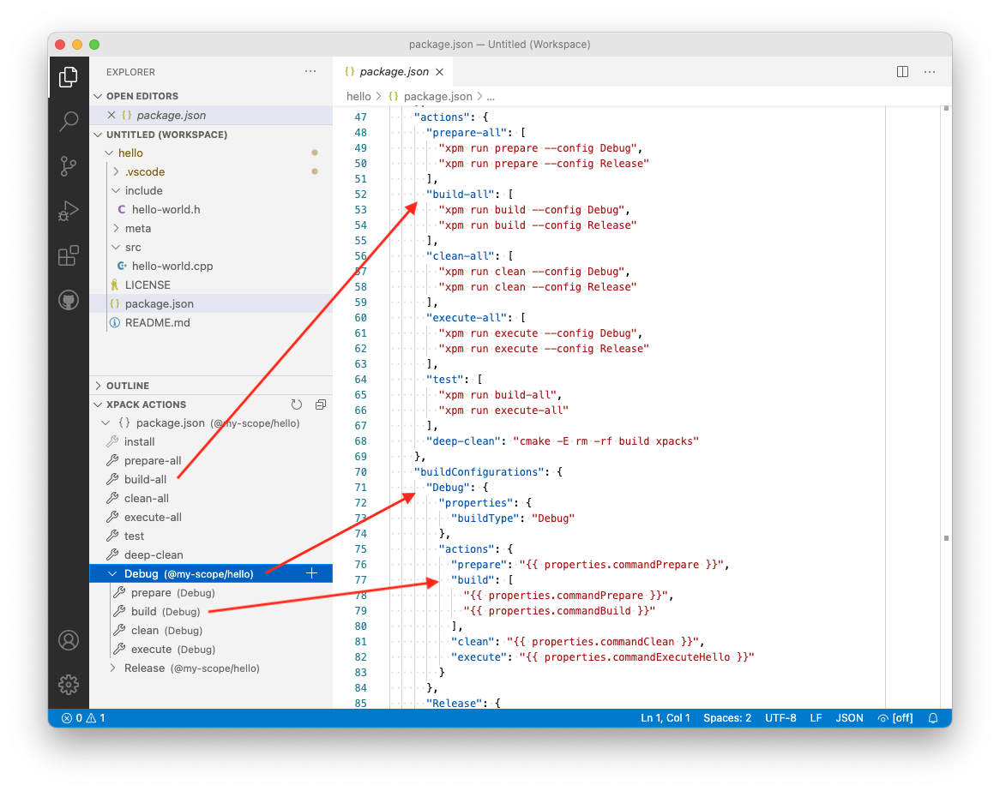

# xPack C/C++ Managed Build (beta)

Manage and build C/C++ projects with CMake, meson, etc, using the xPack tools.

## Features

Manage typical **multi-configuration projects** (like _Debug/Release_), but
also complex, **multi-platform**, **multi-architecture**, **multi-toolchain**
projects, with an emphasis on **modern C/C++** and **embedded** applications.

This sub-project is part of [The xPack Project](https://github.com/xpack).

It is intended as a replacement for the managed build system available
in [Eclipse Embedded CDT](https://projects.eclipse.org/projects/iot.embed-cdt/).

## Requirements

A recent [xpm](https://xpack.github.io/xpm/),
which is a portable [Node.js](https://nodejs.org/) command line application.

For details please follow the instructions in the
[install](https://xpack.github.io/install/) page.

## Quick Start

The simplest way to start with the **xPack C/C++ Managed Build** extension
is to create a simple _Hello World_ project.

Open the [Quick Start](https://xpack.github.io/quick-start/) page in a browser
and follow the steps.

## How it works

The VS Code xPack Managed Build is neutral to the build system,
and basically
can invoke any tools, old and new, but favours modern tools
(like CMake and meson) which can
generate a `compile_commands.json` file, since this
greatly simplifies/automates the project IntelliSense configuration.

## Disclaimer

The xPack Project does not introduce a new package format, but
inherits the simplicity of **npm**; it adds a few more definitions
to `package.json`, but otherwise it uses exactly the same project
format as **npm**; xPacks are actually npm packages, and can be
stored in usual Git repositories, or even published on
[npmjs.com](https://www.npmjs.com/search?q=xpack)
or compatible servers.

## Concepts (configurations & actions)

Compared to typical CMake/meson projects, which in most cases use a
single build folder, an xPack Managed Build project is
by design defined as

> a collection of named **build configurations**

each using a separate build folder, and 

> each with its own set of named **actions**

defined as sequences of commands (stored in JSON as
arrays of string).



To avoid redundant definitions between configurations,
the actions can use generic templates, with substitutions performed by the
[LiquidJS](https://liquidjs.com) template engine, based on
user defined string **properties**.

A typical example of a project with two build configurations,
using CMake, may look like:

```json
{
  "name": "hello-world",
  "version": "0.1.0",
  "description": "A Hello World project",
  "main": "",
  "scripts": {
    "test": "echo \"Error: no test specified\" && exit 1"
  },
  "keywords": [
    "xpack"
  ],
  "license": "MIT",
  "config": {},
  "dependencies": {},
  "devDependencies": {
    "@xpack-dev-tools/cmake": "3.19.2-2.1",
    "@xpack-dev-tools/ninja-build": "1.10.2-2.1"
  },
  "xpack": {
    "properties": {
      "buildFolderRelativePath": "build\\/{{ configuration.name | downcase }}",
      "commandPrepare": "cmake -S . -B {{ properties.buildFolderRelativePath }} -G Ninja -D CMAKE_BUILD_TYPE={{ properties.buildType }} -D CMAKE_EXPORT_COMPILE_COMMANDS=ON",
      "commandBuild": "cmake --build {{ properties.buildFolderRelativePath }}",
      "commandClean": "cmake --build {{ properties.buildFolderRelativePath }} --target clean",
      "commandExecuteHello": "{{ properties.buildFolderRelativePath }}\\/hello-world"
    },
    "actions": {
      "prepare-all": [
        "xpm run prepare --config Debug",
        "xpm run prepare --config Release"
      ],
      "build-all": [
        "xpm run build --config Debug",
        "xpm run build --config Release"
      ],
      "clean-all": [
        "xpm run clean --config Debug",
        "xpm run clean --config Release"
      ],
      "execute-all": [
        "xpm run execute --config Debug",
        "xpm run execute --config Release"
      ],
      "test": [
        "xpm run build-all",
        "xpm run execute-all"
      ]    },
    "buildConfigurations": {
      "Debug": {
        "properties": {
          "buildType": "Debug"
        },
        "actions": {
          "prepare": "{{ properties.commandPrepare }}",
          "build": [
            "{{ properties.commandPrepare }}",
            "{{ properties.commandBuild }}"
          ],
          "clean": "{{ properties.commandClean }}",
          "execute": "{{ properties.commandExecuteHello }}"
        }
      },
      "Release": {
        "properties": {
          "buildType": "Release"
        },
        "actions": {
          "prepare": "{{ properties.commandPrepare }}",
          "build": [
            "{{ properties.commandPrepare }}",
            "{{ properties.commandBuild }}"
          ],
          "clean": "{{ properties.commandClean }}",
          "execute": "{{ properties.commandExecuteHello }}"
        }
      }
    }
  }
}
```

With the help of `xpm`, the complete cycle of prepare/build/execute
can be invoked via:

```bash
cd <project>
xpm install
xpm run test
```

Note: this example assumes the presence of a toolchain, like GCC or clang.

## Known Issues

- **npm** picks `package.json` from xPack dependencies, which is generally
  not useful; the workaround is to add a property to the project
  `.vscode/settings.json`:

```json
"npm.exclude": "**/xpacks/**"
```

## Release Notes

The latest release is **v0.4.7**, which,
according to [semantic versioning](https://semver.org) rules,
means it is _in initial development_ phase.

The xPack extension is functional and can be used for beta-testing, 
but anything MAY
change at any time and the public API SHOULD NOT be considered stable.

More details about each release can be found in the
[releases](https://xpack.github.io/vscode/releases/) page.
