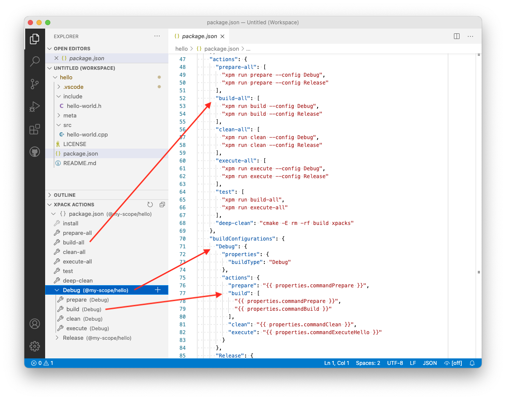
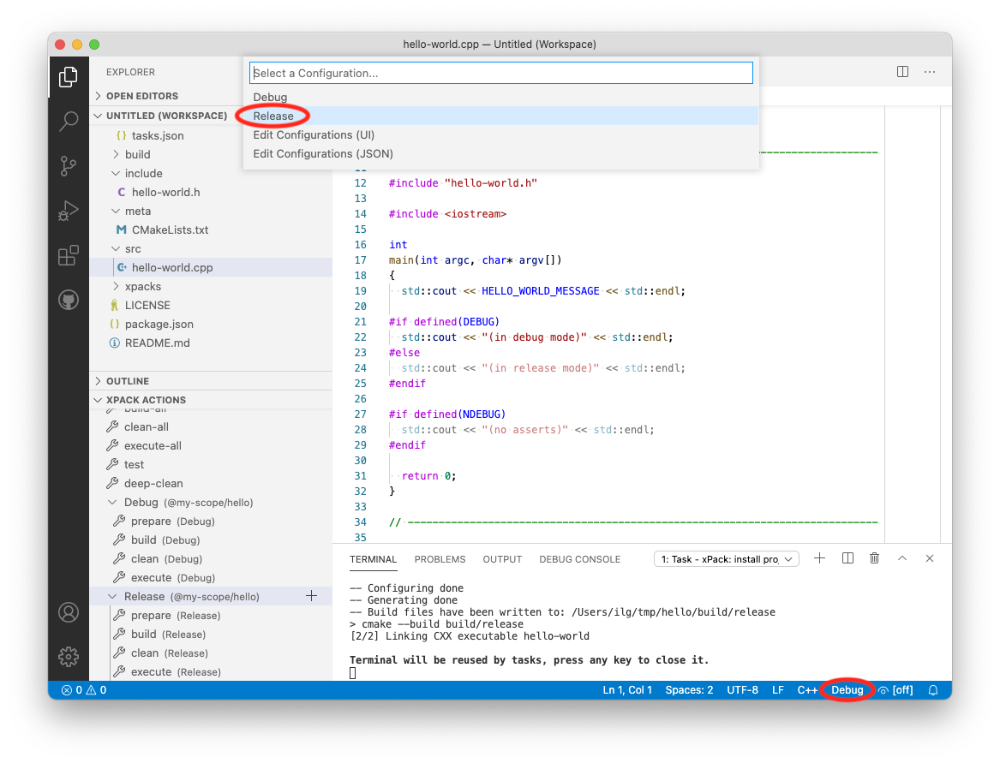
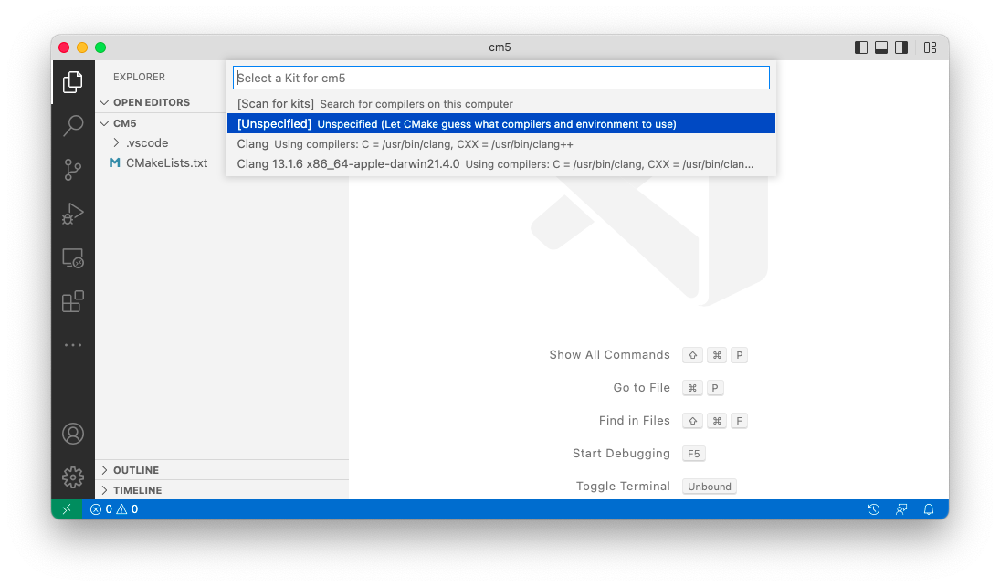

[](https://marketplace.visualstudio.com/items?itemName=ilg-vscode.xpack)
[](https://github.com/xpack/vscode-xpack-extension-ts)
[](https://github.com/xpack/vscode-xpack-extension-ts/blob/xpack/LICENSE)
[](https://typescript-eslint.io)

# xPack C/C++ Managed Build

A Visual Studio Code extension for managing and building C/C++ projects with CMake, Meson,
and other tools, utilising the xPack tools.

This extension is intended as a replacement for the managed build system available
in [Eclipse Embedded CDT](https://projects.eclipse.org/projects/iot.embed-cdt/).
Features related to the automatic generation of build configurations, similar to
Eclipse managed builds, will be available in a future release and will be based on
[xcdl](https://xpack.github.io/xcdl/).

## Features

Manage typical **multi-configuration projects** (such as _Debug/Release_), as well as
complex, **multi-platform**, **multi-architecture**, and **multi-toolchain**
projects, with an emphasis on **modern C/C++** and **embedded** applications.

## Overview

The [xPack C/C++ Managed Build extension](https://xpack.github.io/vscode/)
is an open-source project hosted on
[GitHub](https://github.com/xpack/vscode-xpack-extension-ts) and
forms part of the [xPack Reproducible Build Framework](https://xpack.github.io/).

It can be installed from the Visual Studio Marketplace as
[ilg-vscode.xpack](https://marketplace.visualstudio.com/items?itemName=ilg-vscode.xpack).
All required dependencies (such as the C/C++ extension) are handled automatically.

## Prerequisites (Node.js/npm)

Visual Studio Code 1.102 or later and a recent version of [xpm](https://xpack.github.io/xpm/),
which is a portable [Node.js](https://nodejs.org/) command-line application,
available from [npmjs.com](https://www.npmjs.com/package/xpm/).

```sh
npm install --global xpm@latest
```

For further details, please follow the instructions on the
[installation](https://xpack.github.io/install/) page.

## Quick Start

TL;DR: **View** → **Command Palette...** →
**xPack: Quick Start a Hello World project (C++, CMake)**
(however, it is recommended to read the
[Quick Start](https://xpack.github.io/vscode/quick-start/) page).

The simplest way to begin with the VS Code **xPack C/C++ Managed Build**
extension is to create a basic _Hello World_ project.

Open the
[Quick Start](https://xpack.github.io/vscode/quick-start/)
page in your browser and follow the steps. In addition to being
a fully functional project, the result can serve as an excellent
starting point for more complex projects.

## How it Works

The **xPack Reproducible Build Framework** is not specific to VS Code; it is a set of portable CLI tools,
agnostic to any build system,
which can invoke any third-party tools, both legacy and modern, to perform the actual build.
It favours modern tools
(such as CMake and Meson) which can
generate a `compile_commands.json` file, as this
greatly simplifies integration with indexers (such as VS Code IntelliSense),
but, with some care, can also be used with legacy tools
such as autotools and make.

Future versions of the xPack Reproducible Build Framework are planned to
include an integrated build system generator, similar to that used in
Eclipse CDT.

## Disclaimer

The xPack project does not introduce a new package format, but
inherits the simplicity of **npm**; it adds a few additional definitions
to `package.json`, but otherwise uses exactly the same project
format as **npm**. **xPacks are actually npm packages**, and can be
stored in standard Git repositories, or even published on
[npmjs.com](https://www.npmjs.com/search?q=xpack)
or compatible servers.

## Concepts (Configurations & Actions)

Compared to typical CMake/Meson projects, which in most cases use a
single build folder, an xPack Managed Build project is
by design defined as

> a collection of named **build configurations**

each using a separate build folder, and

> each with its own set of named **actions**

defined as sequences of commands (stored in JSON as
arrays of strings).



To avoid redundant definitions between configurations,
the actions can use generic templates, with substitutions performed by the
[LiquidJS](https://liquidjs.com) template engine, based on
user-defined string **properties**.

A typical example of a project with two build configurations,
using CMake, may look like:

```json
{
  "name": "hello-world",
  "version": "0.1.0",
  "description": "A Hello World project",
  "main": "",
  "scripts": {
    "test": "echo \"Error: no test specified\" && exit 1"
  },
  "keywords": [
    "xpack"
  ],
  "license": "MIT",
  "config": {},
  "dependencies": {},
  "devDependencies": {},
  "xpack": {
    "minimumXpmRequired": "0.20.8",
    "properties": {
      "buildFolderRelativePath": "build{{ path.sep }}{{ configuration.name | downcase }}",
      "toolchainFileName": "toolchain-gcc.cmake",
      "commandPrepare": "cmake -S . -B {{ properties.buildFolderRelativePath }} -G Ninja -D CMAKE_BUILD_TYPE={{ properties.buildType }} -D CMAKE_EXPORT_COMPILE_COMMANDS=ON",
      "commandPrepareWithToolchain": "{{ properties.commandPrepare }} -D CMAKE_TOOLCHAIN_FILE={{ properties.toolchainFileName }}",
      "commandReconfigure": "{{ properties.commandPrepare }}",
      "commandBuild": "cmake --build {{ properties.buildFolderRelativePath }}",
      "commandClean": "cmake --build {{ properties.buildFolderRelativePath }} --target clean",
      "commandExecuteHello": "{{ properties.buildFolderRelativePath }}{{ path.sep }}hello-world"
    },
    "devDependencies": {
      "@xpack-dev-tools/cmake": "3.19.2-2.1",
      "@xpack-dev-tools/gcc": "8.5.0-1.1",
      "@xpack-dev-tools/ninja-build": "1.10.2-2.1"
    },
    "actions": {
      "prepare-all": [
        "xpm run prepare --config Debug",
        "xpm run prepare --config Release"
      ],
      "build-all": [
        "xpm run build --config Debug",
        "xpm run build --config Release"
      ],
      "clean-all": [
        "xpm run clean --config Debug",
        "xpm run clean --config Release"
      ],
      "execute-all": [
        "xpm run execute --config Debug",
        "xpm run execute --config Release"
      ],
      "test": [
        "xpm run build-all",
        "xpm run execute-all"
      ]
    },
    "buildConfigurations": {
      "Debug": {
        "properties": {
          "buildType": "Debug"
        },
        "actions": {
          "prepare": "{{ properties.commandPrepareWithToolchain }}",
          "build": [
            "{{ properties.commandReconfigure }}",
            "{{ properties.commandBuild }}"
          ],
          "clean": "{{ properties.commandClean }}",
          "execute": "{{ properties.commandExecuteHello }}"
        }
      },
      "Release": {
        "properties": {
          "buildType": "Release"
        },
        "actions": {
          "prepare": "{{ properties.commandPrepareWithToolchain }}",
          "build": [
            "{{ properties.commandReconfigure }}",
            "{{ properties.commandBuild }}"
          ],
          "clean": "{{ properties.commandClean }}",
          "execute": "{{ properties.commandExecuteHello }}"
        }
      }
    }
  }
}
```

With a bit of `xpm` magic, the complete cycle of prepare/build/execute
can be reduced to:

```sh
cd <project>

xpm install
xpm run test
```

Note: this example does not require the presence of a compiler
on the system, as it includes a dependency on xPack GCC and a CMake
toolchain description file using it, to prevent CMake from selecting
any other unwanted compiler that may be present.

## VS Code Configurations

The VS Code C/C++ extension manages multiple configurations
in the `.vscode/c_cpp_properties.json` file, and the xPack
extension automatically maps the `package.json` build configurations
to VS Code configurations.

IntelliSense correctly renders the content for the _active_
configuration, shown in the status bar.



## IntelliSense Enabled Only for Top-Level Folders

TL;DR: open separate projects/packages as separate workspace folders.

Due to the specifics of the VS Code C/C++ extension, IntelliSense is
available only if the package is in the root of the workspace folder.

In other words, when opening a workspace folder which includes multiple
packages, IntelliSense will not be enabled.

The correct solution is to open all packages as workspace folders, either
separately or via a `*.code-workspace` file.

## IntelliSense Available Only After the First Build

In order to correctly parse the project, for managed projects,
IntelliSense requires a file called `compile_commands.json`.
One such file is expected in each build
folder, and the system build generator
(CMake/Meson/etc.) automatically creates these files when the
project is prepared, such as during the first build.

## Ignore the Kits Selection Prompt

Although not required by the xPack extension, the CMake extension still
prompts for a _kit_:



Select _Unspecified_, as kits are not used by the xPack extension.

This issue is currently under consideration by the CMake Tools project
and is expected to be resolved in a future release.

## Known Issues

- None at present.

## Project Templates

Creating new projects is automated using project templates.

### Create a Hello World Project

The **Quick Start a Hello World project** command described above creates
a C++ project built with CMake.

The full set of options is available when executing the
**xPack: Create a Hello World project** command, which is an interactive
application requiring user input.

The result is similar, but may use different build tools or
languages (C vs C++).

When this command is invoked, VS Code instantiates the separate
project template available from:

- <https://github.com/xpack/hello-world-template-xpack/>

### Create a Hello World QEMU Semihosted Project

In addition to native projects running on the host system, it is possible
to create Arm Cortex-M, Arm Cortex-A (32/64-bit), and RISC-V (32/64-bit)
bare-metal projects running on QEMU.

When this command is invoked, VS Code instantiates the separate
project template available from:

- <https://github.com/micro-os-plus/hello-world-qemu-template-xpack>

## Release Notes

The latest release is **v1.2.2**, which,
according to [semantic versioning](https://semver.org) rules,
means it is in the _production_ phase.

The xPack extension is functional, but further improvements are to be
expected in future releases.

More details about each release can be found on the
[releases](https://xpack.github.io/web-archive-jekyll/vscode/releases/) pages.

## Licence

The original content is released under the
[MIT Licence](https://opensource.org/licenses/MIT), with all rights
reserved to [Liviu Ionescu](https://github.com/ilg-ul/).
