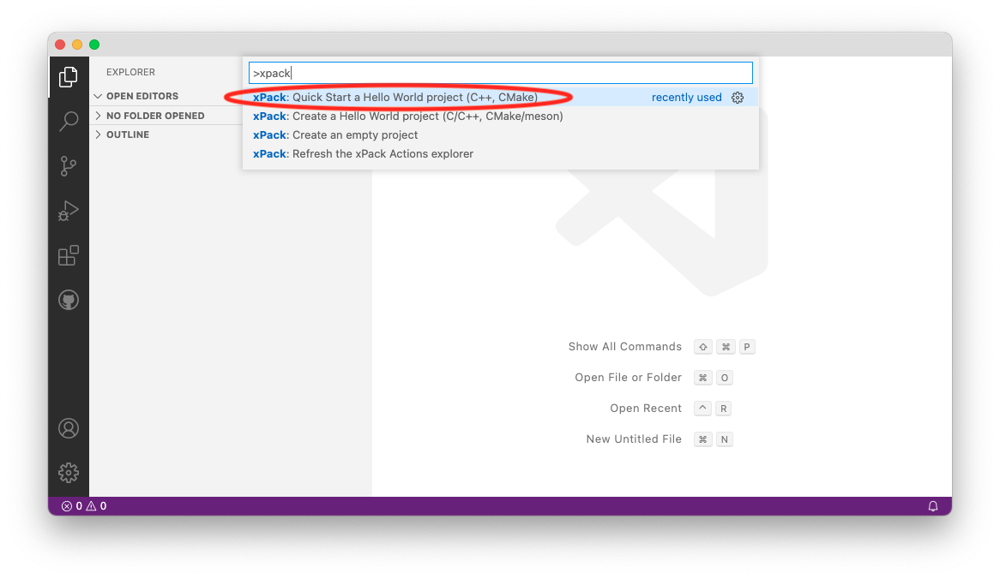
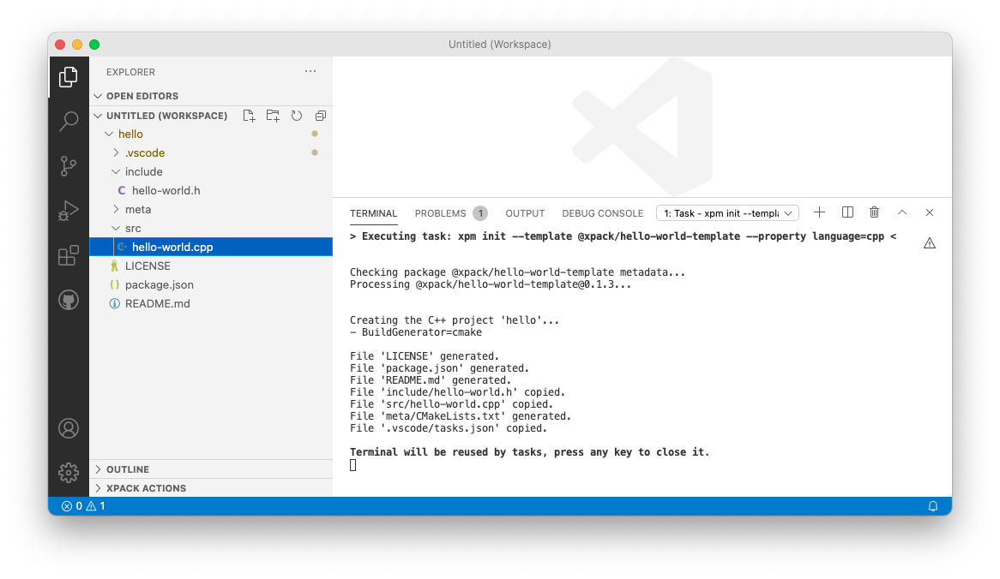
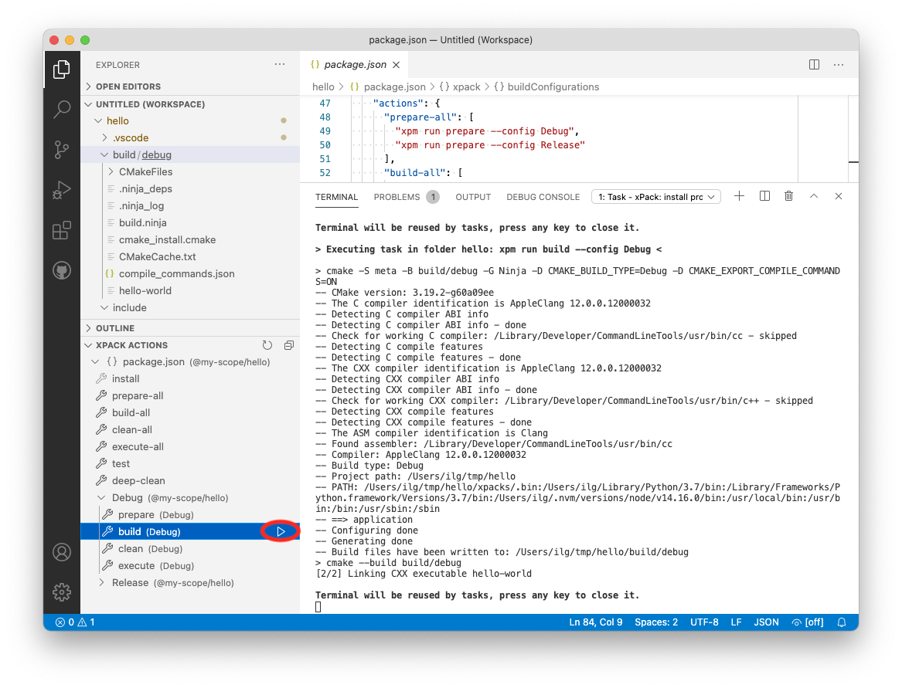

# xPack C/C++ Managed Build (evaluation!)

Manage and build C/C++ projects with CMake, meson, etc, using the xPack tools.

## Features

Manage typical **multi-configuration projects** (like _Debug/Release_), but
also complex, **multi-platform**, **multi-architecture**, **multi-toolchain**
projects, with an emphasis on **modern C/C++** and **embedded** applications.

This sub-project is part of [The xPack Project](https://github.com/xpack).

It is intended as a replacement for the managed build system available
in [Eclipse Embedded CDT](https://projects.eclipse.org/projects/iot.embed-cdt/).

## Requirements

A recent [xpm](https://xpack.github.io/xpm/),
which is a portable [Node.js](https://nodejs.org/) command line application.

For details please follow the instructions in the
[install](https://xpack.github.io/install/) page.

## Quick Start

The simplest way to start with the **xPack C/C++ Managed Build** extension
is to create a simple _Hello World_ project.

### Create a Hello World C++ project

The easiest way to create a _Hello World_ project is:

- open the **Command Palette** (in the **View** menu, or with the
platform specific keyboard shortcut)
- type `xpack` to filter the list of available commands
- select the **Quick Start a Hello World project (C++, CMAke)**.



The project creation requires an empty folder. The xPack extension asks
the user for the location of this folder.

For this test, a folder called `tmp/hello` was created in the user home folder.


Once the folder is selected, the xPack extension invokes `xpm init` to
create a new project based on the
[@xpack/hello-world-template](https://github.com/xpack/hello-world-template-xpack)
which is a separate source xPack.

The command is executed in a separate shell, and the console output
looks like this:



The result is a simple project, with:

- a `src` folder with the source file `hello-world.cpp`
- an `include` folder with the header file `hello-world.h`,
- a `meta` folder with the additional metadata for performing the build
(in this case a CMake `CMakeLists.txt` configuration file).

The same result can be obtained by running the following commands in a
terminal:

```sh
mkdir ~/tmp/hello
cd ~/tmp/hello
xpm init --template @xpack/hello-world-template@latest
```

### xPack Actions

Once the project is created, the **xPack Actions** explorer should become
visible in the bottom left part of the screen:


Note: If this does not happen automatically, at first use it might
be necessary to enable this explorer by running the command
**Explorer: Focus on xPack Actions View**, or by Right Clicking on any
of the explorers on the bottom left corner, and enabling
**xPack Actions**.

Once enabled, the explorer shows two build configurations,
**Debug** and **Release**.

The explorer also shows multiple actions, which have
associated custom sequences of commands (shown as tooltips).
There are global
actions, and actions specific to each build configuration.
Actions can be executed by clicking the **Run** triangular icon.

#### Tooltips

As most of other graphical objects, the xPacks Actions explorer shown
additional information as tooltips, visible after hovering with the
mouse for a few moments on the visible items.

### Satisfy dependencies

The xPack project provides cross-platform binary tools which can be
automatically linked to xPack projects.

In this example, the generated project includes development dependencies
to specific versions of **CMake** and **ninja**.

To satisfy these dependencies, click the **Run Command** button
in the explorer:


The same result can be obtained by running the following command in the
project folder:

```sh
xpm install
```

Note 1: using the xPack binary tools is not mandatory, for example
GNU/Linux users may very well continue to build their projects
in the traditional way, with tools installed via the system package
manager; however, for macOS and Windows users, having a convenient
way to install additional binary tools might be highly appreciated.

Node 2: the binary xPacks are strictly versioned, and for obtaining
reproducible builds it is always useful to lock a project to a set
of tools, completely independent o the versions used by other
projects and from the versions available in the system.

### Perform the build

With the binary tools available, the build can be invoked by selecting
the desired configuration in the explorer (**Debug** in this case),
and the clicking the **Run Action** icon at the right side of the
**build** action.



The result is a `build/debug` folder, where CMake performed the build.

The same result can be obtained by running the following command in the
project folder:

```sh
xpm run build --config Debug
```

### Execute the Hello World application

The resulting binary file is a regular ELF, which can be started as usual
in a terminal.

As a shortcut, the project includes an `execute` action, which
invokes the `hello-world` executable:


### IntelliSense

For build system generators which create the `compile_commands.json` file
(like CMake and meson), the xPack extension automatically
adds the paths to these files in the `.vscode/c_cpp_properties.json` file,
and the VSCode automatically processes them.


As it can be seen, the editor renders dead code in gray, which is a good sign
that the project was configured correctly.

### Switching build configurations

The **xPack C/C++ Managed Build** extension uses the
**Microsoft C/C++** extension,
which is able to handle multiple configurations.

To test this, also build the release binaries (by clicking the `build`
action in the **Release** section of the **xPacks Actions** explorer),
then click the Debug entry shown on the bootom Status Bar, which should
open a picker to select the desired configuration:


After selecting Release, the editor will automatically update the content,
and show the debug dead code as grey:


### Closing the workspace

When closing the workspace, either by closing VSCode, or via the **File** menu,
VSCode asks the user permission to save the workspace configuration
as a file:


This is optional, and for independent projects, it is not of much help,
so it can be skipped (click the **Don't Save** button).

However, for complex projects which comprise multiple projects, it
might be useful to group all folders as an workspace, and open all
in the same VSCode instance.

## Create an empty project

The recommended way to start a new project is to create a simple
Hello World project, which includes the two (Debug/Release)
build configurations, each with the usual build/clean actions,
and later extend the project with the actual application code.

However, for those who prefer to start from scratch, it is possible to
create an empty project, without any build configurations and actions,
and manually add them to any custom configuration.


## How it works

The xPack Managed Build is neutral to the build system, and basically
can invoke any tools, old and new, but favours modern tools
(like CMake and meson) which can
generate a `compile_commands.json` file, since this
greatly simplifies/automates the project IntelliSense configuration.

## Disclaimer

The xPack Project does not introduce a new package format, but
inherits the simplicity of **npm**; it adds a few more definitions
to `package.json`, but otherwise it uses exactly the same project
format as **npm**; xPacks are actually npm packages, and can be
stored in usual Git repositories, or even published on
[npmjs.com](https://www.npmjs.com/search?q=xpack)
or compatible servers.

## Concepts

Compared to typical CMake/meson projects, which in most cases use a
single build folder, an xPack Managed Build project is
by design defined as a collection of named **build configurations**,
each using a separate build folder, and each with its own set of
named **actions**, defined as sequences of commands (stored in JSON
arrays of string).

To avoid redundant definitions between configurations,
the actions can use generic templates, with substitutions performed by the
[LiquidJS](https://liquidjs.com) template engine, based on
user defined string **properties**.

A typical example of a project with two build configurations,
using CMake, may look like:

```json
{
  "name": "hello-world",
  "version": "0.1.0",
  "description": "A Hello World project",
  "main": "",
  "scripts": {
    "test": "echo \"Error: no test specified\" && exit 1"
  },
  "keywords": [
    "xpack"
  ],
  "license": "MIT",
  "config": {},
  "dependencies": {},
  "devDependencies": {
    "@xpack-dev-tools/cmake": "3.19.2-2.1",
    "@xpack-dev-tools/ninja-build": "1.10.2-2.1"
  },
  "xpack": {
    "properties": {
      "buildFolderRelativePath": "build\\/{{ configuration.name | downcase }}",
      "commandPrepare": "cmake -S . -B {{ properties.buildFolderRelativePath }} -G Ninja -D CMAKE_BUILD_TYPE={{ properties.buildType }} -D CMAKE_EXPORT_COMPILE_COMMANDS=ON",
      "commandBuild": "cmake --build {{ properties.buildFolderRelativePath }}",
      "commandClean": "cmake --build {{ properties.buildFolderRelativePath }} --target clean",
      "commandExecuteHello": "{{ properties.buildFolderRelativePath }}\\/hello-world"
    },
    "actions": {
      "prepare-all": [
        "xpm run prepare --config Debug",
        "xpm run prepare --config Release"
      ],
      "build-all": [
        "xpm run build --config Debug",
        "xpm run build --config Release"
      ],
      "clean-all": [
        "xpm run clean --config Debug",
        "xpm run clean --config Release"
      ],
      "execute-all": [
        "xpm run execute --config Debug",
        "xpm run execute --config Release"
      ],
      "test": [
        "xpm run build-all",
        "xpm run execute-all"
      ]    },
    "buildConfigurations": {
      "Debug": {
        "properties": {
          "buildType": "Debug"
        },
        "actions": {
          "prepare": "{{ properties.commandPrepare }}",
          "build": [
            "{{ properties.commandPrepare }}",
            "{{ properties.commandBuild }}"
          ],
          "clean": "{{ properties.commandClean }}",
          "execute": "{{ properties.commandExecuteHello }}"
        }
      },
      "Release": {
        "properties": {
          "buildType": "Release"
        },
        "actions": {
          "prepare": "{{ properties.commandPrepare }}",
          "build": [
            "{{ properties.commandPrepare }}",
            "{{ properties.commandBuild }}"
          ],
          "clean": "{{ properties.commandClean }}",
          "execute": "{{ properties.commandExecuteHello }}"
        }
      }
    }
  }
}
```

Using xpm, the complete test of build/test can be invoked with:

```bash
cd <project>
xpm install
xpm run test
```

Note: this example assumes the presence of a toolchain, like GCC or clang.

## Known Issues

- too early to call

## Release Notes

The list is kept in reverse chronological order, with the most recent
release on the top.

### 0.4.3

A new development release which adds:

- support to create new projects from templates
- internal watchers to automate refresh on package.json changes

### 0.3.2

A new development release with functional IntelliSense which adds:

- commands to create configs & actions
- `xpm install` as a separate entry in the explorer, runnable

### 0.2.2

A new development release which adds the following:

- since the project grew, as recommended, webpack was used to pack all code
  into a single compact file;
- IntelliSense support was added via `c_cpp_properties.json` (making
  use of the `ms-vscode.cmake-tools` configuration provider); the new
  status bae entry is no longer needed and was disabled;
- generic template support was added by performing Liquid substitution,
  mainly to compute `buildFolderRelativePath` but also to show
  actions tooltips.

### 0.1.5

An early preview release, which adds the following:

- an **xPacks Actions** explorer, implemented as a tree view, which allows
  a convenient way to navigate between multiple build configurations and
  actions; to make it visible, open a `package.json`
  created via `xpm init` and add the `xpack` property
  (for example from the above code);
- actions are integrated into the usual VSCode workflow by associating
  internal tasks with each action; separate tasks are added for common
  commands like `xpm install`;
- ~~a status bar entry used to select the active build configuration
  to be used by IntelliSense
  (integration with IntelliSence is not yet implemented)~~.

### 0.0.1

Initial release with minimal content, intended to validate the workflow.

There is only one simple action defined, _xPack: Greeting_,
which prints a short message.
